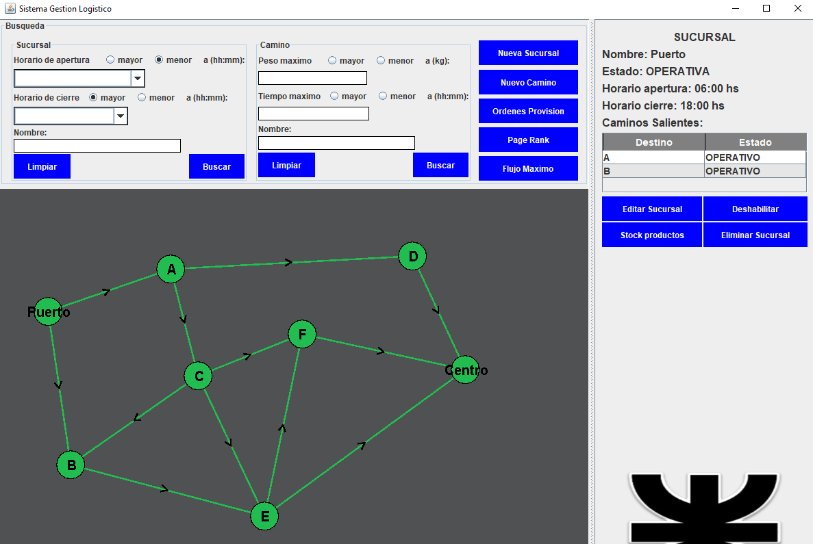
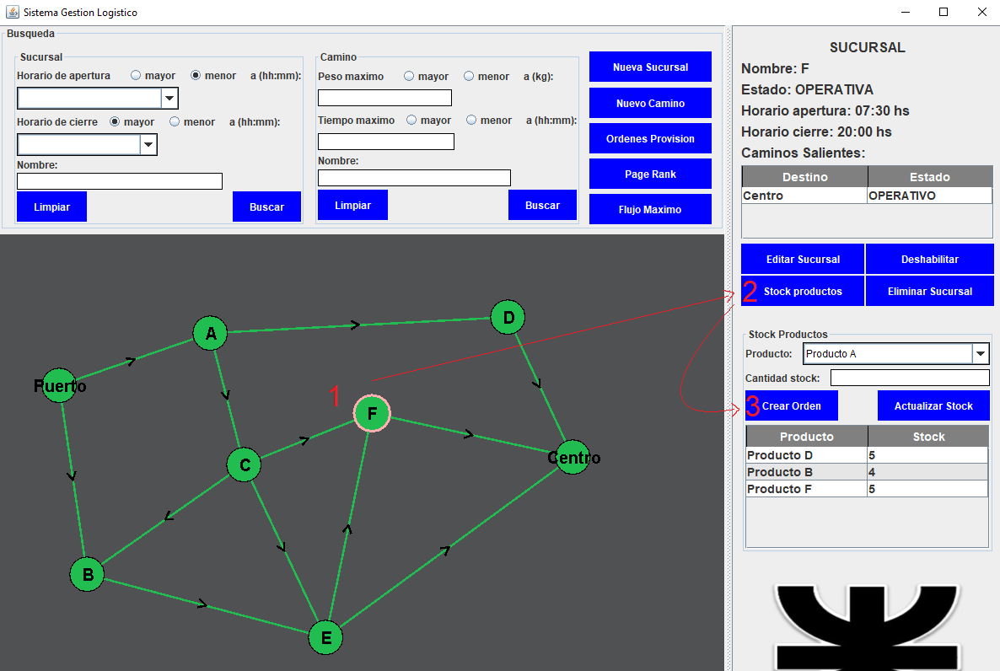
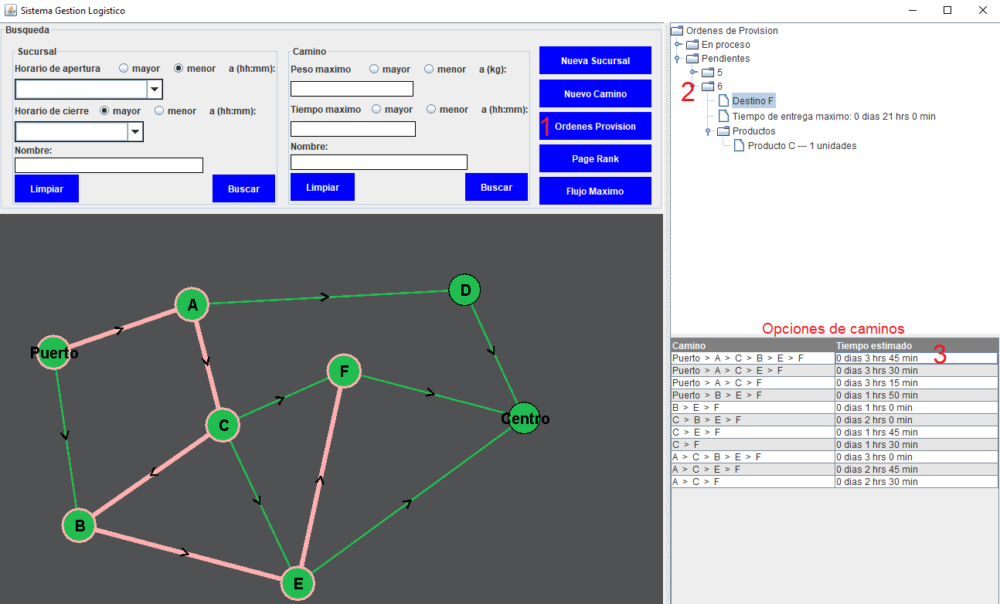
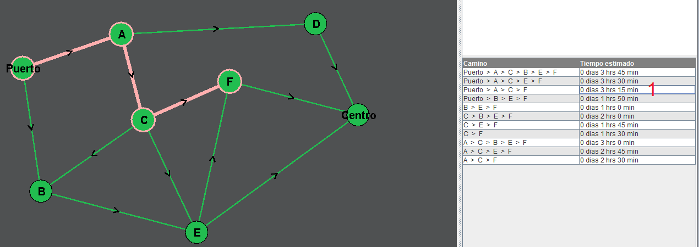
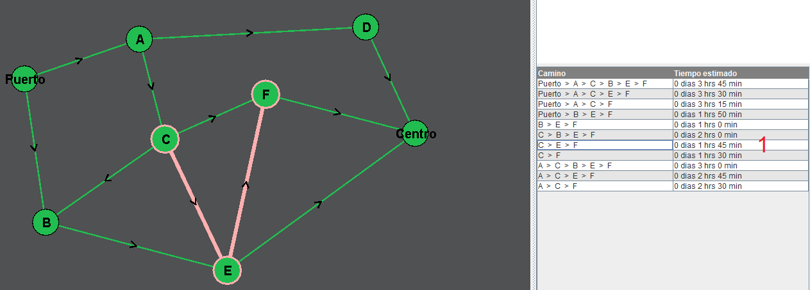

# Sistema de Gestión Logístico JAVA

### Herramientas utilizadas

-   Lenguaje `Java 17`

-   Para la persistencia de los datos se optó por base de datos `MySQL` con implementación del ORM `hibernate` junto a `Springboot`.

-   Para visualización UI se optó por el manejador de interfaces gráficas del IDE `InteliJ Idea`.
(La ejecución en otros IDE no garantiza su correcta compilación). 

-   Para la gestión de dependencias se optó por `Maven`.

### Problema
Una empresa que posee varias sucursales necesita un sistema que permita identificar el camino más óptimo a seguir por el vehículo transportador.

### Solución

*Resumen*:  
Se realizó un sistema que permite hacer CRUD (ABMC) de sucursales y los caminos entre ellas.
En el caso de que una sucursal necesite más productos, puede crear una orden de provisión en la cual el sistema, mediante la aplicación de teoría de grafos, encuentra los caminos óptimos de entrega en base a la disponibilidad de las demás sucursales.

#### Ejemplo: Crear orden de provisión y visualizar caminos óptimos.

ACLARACIÓN: Si desea probar el sistema, encontrará en la carpeta SQL scripts para ejecutar en su base de datos local con datos de ejemplo.

Vista principal del sistema.

Hacemos click en la sucursal deseada --> stock productos --> crear orden. 
Se abrirá una ventana que permitirá dar de alta una orden de provisión.

Una vez creada la orden, nos dirigimos a órdenes de provisión y buscamos dentro de pendientes la que hemos creado.
Se desplegará una lista de caminos, los cuales pueden ser vizualizados en el grafo.

Otros caminos posibles.

### Issues.

- No se realizó CRUD de producto. Se utilizan productos seteados por SQL en base de datos.

- En todos los text field de formato hh:mm se permite colocar cualquier número.
Lo cual es erróneo en los siguientes casos:
    - En Horario de cierre/apertura de Sucursal, Nueva sucursal
    - En Horario de cierre/apertura de Sucursal, Editar sucursal

- Si existe un camino de ida y otro camino de vuelta entre dos sucursales, en el grafo solo se puede seleccionar UN solo camino de esos dos. (El camino que esté colocado último en la lista de caminos.)
